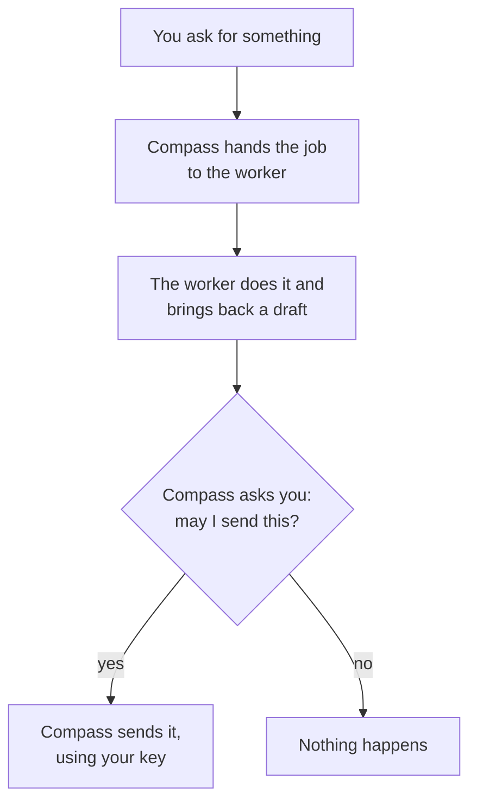
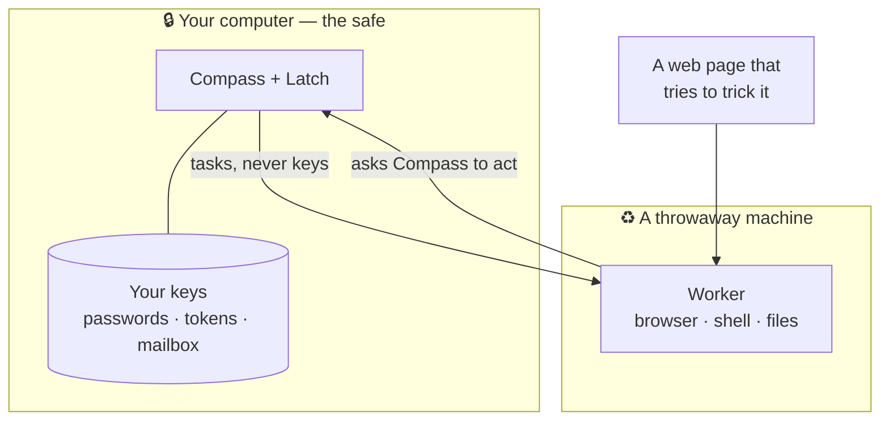
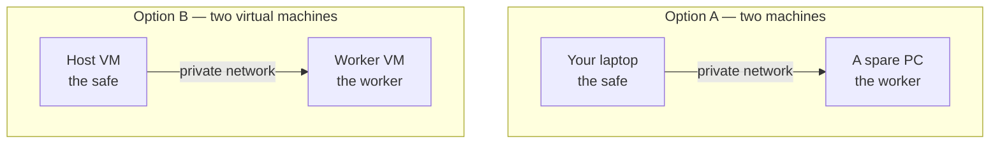

# What is this?

> **This is the simple version.** It rounds off corners and leaves things out on purpose.
> For the precise version — including the security model — read [README.md](./README.md)
> and [SECURITY.md](./SECURITY.md).

## In one sentence

**Compass** is an assistant you talk to that remembers your things and can actually go and do
them. **Latch** is the safe underneath it that holds your passwords and decides what is allowed.

It exists for a specific reason: good ideas die from lack of time, energy or headspace, not
from lack of ideas. This is meant to be a shared, not-for-profit service for getting them done
— not another thing competing for your attention.

## What happens when you ask for something

The diamond is the one that matters. The worker did the work, but it cannot send anything — it
has to come back through Compass, and Compass comes back to you.

## Why it is split in two

Assistants that can do real things need your passwords. That is the whole problem. So the half
that does the work never holds them:

**There is no line from the worker to your keys.** That is the entire design. Assistants do get
tricked by things they read — so the one that reads the web is the one given nothing worth
stealing, and it is meant to be thrown away and rebuilt.

## What you get, at three levels

| | What it can do |
|---|---|
| **Chat only** | Conversation, nothing more |
| **Compass Simple** | Remembers, keeps goals and a task list, asks you for approvals |
| **Compass Pro** | All of that, plus a worker that can really browse, run things and handle files |

## Setting it up

**Honest warning: there is no easy version of this.** It needs two separate computers — or two
virtual machines on one — a free [Tailscale](https://tailscale.com) account to connect them
privately, and about an evening.

That second machine is not accidental complexity — it *is* the safety. One computer holding
both your keys and the thing that browses the web is the arrangement this exists to avoid.

If that sounds like your kind of evening, start at
**[GETTING-STARTED.md](./GETTING-STARTED.md)** — it walks the whole thing for both layouts.

## More

[README.md](./README.md) · [Security model](./SECURITY.md) ·
[Where the boundary is](./AGENT-BOUNDARY.md) · [Why it's not-for-profit](./COMMUNITY-MISSION.md)
