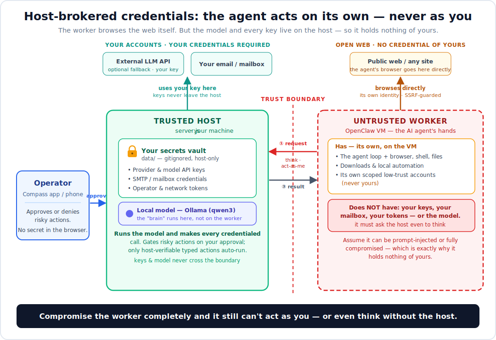

# Host-brokered credentials: the agent never holds your keys

*A design note on how Compass/Latch keeps a compromised AI worker from ever touching a secret.*

## The problem

The moment you give an AI agent real power — a browser, a shell, an inbox, the
ability to call paid APIs — you have to give it real credentials. Provider API
keys, SMTP passwords, session tokens. And an agent is exactly the wrong thing to
hand a secret to:

- It runs untrusted model output as if it were a plan.
- It reads web pages, emails, and files that an attacker can write to — so it is
  **prompt-injectable by design**.
- If it's a disposable VM or container, its whole filesystem is one `cat` away
  for anything that gets a foothold.

So the agent is simultaneously the component most likely to be turned against you
and, in the naive design, the component holding the keys to everything you own.

## The usual answers, and why they're partial

Most hardening work tries to make the secret *harder to find* on the agent:

- **Mask it in config** — strip plaintext keys out of the files the agent writes,
  keep only secret-references.
- **Env vars / secret managers** — inject at runtime instead of persisting.
- **Warn about stale copies** — doctor checks for old backups that still hold keys.

These are all worth doing. But they share one assumption: *the key still lives
somewhere the agent process can reach.* A prompt-injected or compromised agent
that can run code in its own process can still read its own environment, its own
memory, its own injected secrets. You've raised the bar, not removed the target.

## The pattern: don't hide the key from the agent — never give it to the agent

Split the system into two trust domains:

- A **trusted host** — small, boring, on hardware you control. It holds *all*
  credentials and is the only thing that ever makes an authenticated outbound
  call.
- An **untrusted worker** — the AI agent's *hands*: the agent loop, the browser,
  the shell, all the dangerous surface. It browses the open web directly and can
  hold its own scoped, low-trust accounts. What it never holds is **yours** —
  your API keys, your mailbox, your tokens — *or the model*. For anything that
  needs a credential (including running the model), it gets a scoped key that
  lets it *ask*, not *act*.

The worker is not caged from the internet — caging it would make it useless. It
browses and automates under its own identity. But the model itself runs on the
host: the worker calls back for completions, so no model key ever sits on the
worker either. The boundary is about *whose* credentials get used and *where the
brain lives*, not *whether* the worker can reach the world.

When the agent wants to do something that needs a secret, it doesn't use a
secret. It calls back to the host:

1. **① Request** — when (and only when) the worker needs one of *your* accounts,
   it asks the host to perform that action ("send this email from my address",
   "call this paid API with my key"). The request crosses the boundary; no key
   does. Anything the worker can do under its own identity — browsing, its own
   local model — it just does, without asking.
2. **② Broker** — the host holds the real credential, makes the actual call to
   the external service, and applies its own policy (is this action typed and
   verifiable? does it need operator approval?).
3. **③ Result** — the host returns only the *result* to the worker. The secret
   never travels.

The operator sits on the trusted side and approves anything risky. Auto-execution
is reserved for **host-verifiable, typed operations** — never arbitrary
worker-asserted plans, because the whole point is that the worker's judgment
can't be trusted.

## What this buys you

The security property is blunt and easy to state:

> **A fully compromised worker has no secret to read — because it was never given one.**

Prompt-inject the agent, pop its VM, dump its whole disk and memory — the attacker
gets a scoped "ask the host" key and nothing else. They can *request* actions,
but every request that matters hits the host's policy and, for anything risky, a
human approval gate. The blast radius of a compromised agent is bounded by what
the host will *broker*, not by what the agent can *hold*.

It also collapses the "stale backup still has the key" class of bug entirely:
there is no key on the worker to leak, in the config, the environment, a backup,
or a core dump.

## Honest limitations

This isn't a silver bullet, and it isn't free:

- **It moves trust to the host, it doesn't eliminate it.** If the host is
  compromised, it's over. The bet is that a small, non-agentic, operator-controlled
  host is a *much* smaller and more defensible target than an agent runtime.
- **The host has to broker each capability.** Every new power (send email, call
  this API) is a typed operation the host has to understand. That's more work than
  handing over a key — deliberately. It's also what keeps auto-execution honest.
- **Latency and plumbing.** Every credentialed action is a round-trip to the host.
- **It's most natural for single-operator / self-hosted setups.** The same shape
  generalizes to multi-tenant (a broker/proxy at a different privilege level), but
  the version described here is built for one operator who runs their own host.

## How it's implemented in Compass/Latch

[Compass/Latch](https://github.com/joergensentroels/Latch) is a self-hosted AI
agent gateway built entirely around this boundary:

- The **host** (`server.js`) holds every secret in a gitignored `data/`
  directory and exposes only typed, policy-checked endpoints.
- The **worker** (an OpenClaw VM running the agent) polls a scoped feed and posts
  requests/approvals with an agent key that can't read operator state, approve its
  own requests, or hold credentials.
- Risky and arbitrary operations always require operator approval; only
  host-verifiable typed operations can auto-run.

If you're building anything that gives an AI agent real-world reach, the takeaway
is portable even if you never touch this code: **treat the agent as hostile, and
put the credentials on the other side of a boundary it can only talk *through*,
never *hold*.**

---

*Feedback and holes-poking welcome — open an issue or a
[security advisory](https://github.com/joergensentroels/Latch/security/advisories/new).*
